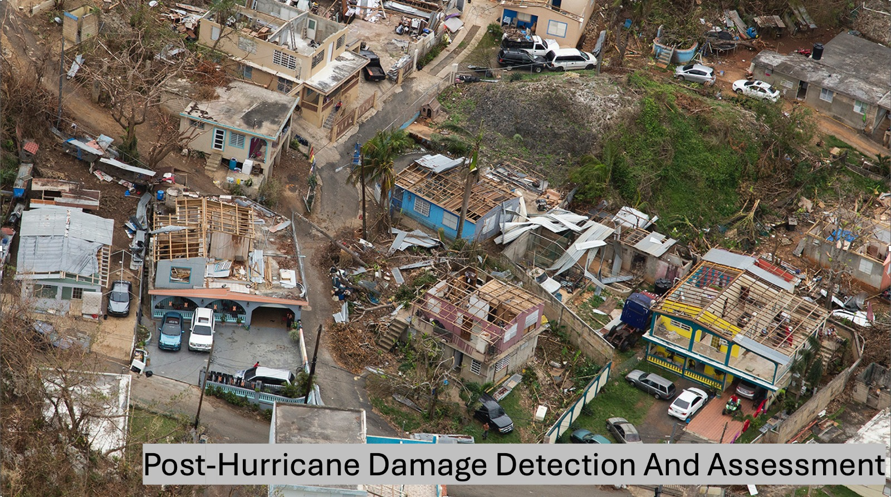

# 🌪️ Post-Hurricane Damage Detection with Deep Learning

A machine learning-powered solution for rapid post-disaster assessment using aerial imagery. This project leverages deep learning models—ResNet50, CNN, and EfficientNet—to classify structural damage caused by hurricanes. Designed for real-time predictions via a Streamlit web interface.

---

## 👩‍💻 Team Members
- **Srinivas Saiteja Tenneti**
- **Namratha Prakash**
- **Lakshmi Sreya Rapolu**

---

## 📌 Project Overview

Hurricanes in the U.S. cause an average of **$21.5 billion** in damage per event, with over 10 billion-dollar storms annually between 2015 and 2020. Accurate and rapid **post-hurricane damage assessment** is essential for emergency response, insurance processing, and recovery planning.

This project builds an AI system that:
- Detects structural damage from **aerial images** post-hurricane
- Utilizes **transfer learning** with **ResNet50 and EfficientNet** models
- Deploys a **Streamlit web app** for interactive image uploads and predictions

---

## 🛰️ Dataset

- **Source**: University of Washington Disaster Data Science Lab
- **Location**: Houston, TX (Post Hurricane Harvey)
- **Images**: 14,000 (7,000 damaged, 7,000 undamaged)
- **Splits**:
  - `Train`: 8,000
  - `Validation`: 2,000
  - `Test`: 2,000 (also tested on unbalanced and balanced subsets)

---

## 🛠️ Key Techniques Used

- Data Normalization & Augmentation (`RandomHorizontalFlip`)
- PCA for feature reduction
- Custom & pre-trained models
- Evaluation metrics: Accuracy, Confusion Matrix, F1-score
- Streamlit-based real-time interface for multi-image upload

---
# 📊 Exploratory Data Analysis (EDA)

To build a robust hurricane damage classification model, we performed in-depth exploratory data analysis (EDA) to uncover key visual and statistical signals differentiating damaged from undamaged structures.

---

## 🔍 Challenges in Damage Detection

- **No Single Definition of "Damage"**: Can include debris, discoloration, roof collapse, or minor structural shifts.
- **False Visual Triggers**: Materials scattered for other reasons can look like damage.
- **Intra-Class Variability**: Buildings in the same class vary greatly in size, shape, and appearance.
- **AI Ambiguity**: Damage is often subtle or context-dependent, making detection by machines inherently challenging.

---

## 🖼️ Visual Inspection of Image Data

- **Format**: RGB, 128×128 pixels  
- **Content**: Aerial view of rooftops and structures post-hurricane

**Observations:**
- 🌊 Flood patterns with unique texture and tone  
- 🧱 Scattered debris and damaged rooftops  
- 👀 Human-eye struggle: Subtle patterns not always easily visible

---

## 📈 Class Trends: Pixel-Level Averages

We computed mean grayscale intensity across images in each class:

| **Damage** | **No Damage** |
|------------|---------------|
| Brighter cores with dark surroundings | More uniform brightness across the image |
| Suggests collapsed or open roof areas | Indicates intact, cleaner structural surfaces |

---

## 🌡️ Standard Deviation: Visual Variability

Pixel-wise standard deviation helps visualize variability:

| **Damage** | **No Damage** |
|------------|---------------|
| Lower variation across the image | Higher variation near core structure |
| Uniformity due to debris/flooding | Variation from visible rooftops and shadows |

---

## 🧬 PCA Analysis: Dimensional Reduction

Principal Component Analysis (PCA) was used to extract key visual patterns:

| Class       | Components to explain 70% variance |
|-------------|------------------------------------|
| Damage      | 19                                 |
| No Damage   | 56                                 |

> 🧠 **Insight**: Damaged images have more visual consistency, making them easier for models to learn from.

---

## 🧠 Raw Pixel Intensity Distribution

We compared the mean intensity of the first 1,000 pixels across classes:

- **Damage**: Lower, noisier intensity — possibly due to shadows and debris  
- **No Damage**: Higher and smoother intensity — cleaner rooftops

---

## 🌍 Geospatial Distribution of Images

- Aerial tiles are spread across **Houston, Beaumont, and Victoria** (Texas)
- Damage and no-damage classes cluster by location

⚠️ **Risk**: Models might pick up on geographic cues instead of real damage features

---

## ✅ Key Takeaways

- **Strong statistical signals** in pixel-level data  
- **Class imbalance handled**  
- **Geographic clustering** introduces potential bias  
- **PCA & intensity trends** support model learning

---

## 🧠 Model Highlights

### 🏗️ Custom CNN (from scratch)
- Input: `128x128 RGB images`
- Architecture: 3 Conv Layers + 4 FC Layers
- Accuracy:
  - ✅ Train: 99.48%
  - ✅ Validation: 96.25%

---

### 🦾 ResNet50 (Transfer Learning)
- Input: `224x224`, ImageNet normalized
- Accuracy:
  - ✅ Validation: **99.50%**
  - ✅ Test Set: **99.61%**
- 🧠 Best model for generalization and deployment

---

### 🌱 EfficientNet Models
#### EfficientNet-B0:
- Accuracy: 99.30%
- Lightweight and fast but slightly underperformed vs. ResNet50

#### EfficientNet-V2-S:
- **Frozen:** 91.7% accuracy — very fast but limited learning
- **Fine-tuned (Last 2 Blocks):** 97.95% — efficient and effective

---

## 💻 Streamlit Web App

Interactive interface for uploading and classifying images.

### Features:
- Multi-image upload with grid view
- Class predictions (damage / no damage)
- Confidence scores with visual indicators
- Session-wise prediction history
- Optional visualization of transformed model input
- Lightweight and runs locally or on any Streamlit-compatible server

---

## 📈 Sample Result Snapshot

- ✅ **ResNet50 Confusion Matrix**
  - True Positives: 7,980
  - False Negatives: 20
  - True Negatives: 985
  - False Positives: 15
  - Accuracy: **99.61%**

---

## 🚀 Future Work

- Multi-class damage levels (minor/moderate/severe)
- Integrate Grad-CAM for visual attention maps
- Expand to detect other disaster types: fire, floods, earthquakes
- Incorporate geospatial overlays using GIS libraries

---

## 📷 Sample Visuals (Coming Soon)

- Eigenimages from PCA
- Geospatial distribution heatmaps
- Grad-CAM overlays (model attention)

---

## 📬 Contact

For questions or contributions, reach out via GitHub Issues or connect with the team:

- **[Srinivas Saiteja Tenneti](https://www.linkedin.com/in/srinivas-saiteja-tenneti/)**

---

## 🔗 References
- [Dataset on IEEE Dataport](https://ieee-dataport.org/open-access/detecting-damaged-buildings-post-hurricane-satellite-imagery-based-customized)
- [University of Washington Disaster Data Science Lab](https://disasterdatascience.org/)

---

> “In the aftermath of a hurricane, every second counts. With AI-driven tools, response teams can act faster and smarter.” – Group 8

## 📬 Contact
For questions, contact any team member via this repository's issue tracker.

